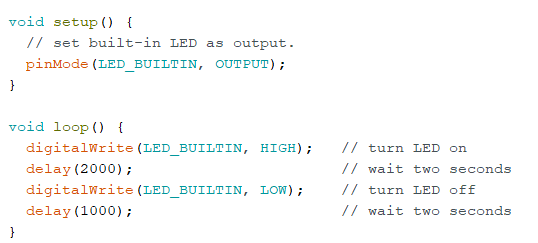

# IDD-Fa18-Lab1: Blink!

**A lab report by Eva Pilar Esteban Velasco**

**Fork** this repository to get a template for Lab 1 for *Developing and Designing Interactive Devices* at Cornell Tech, Fall 2018. You should modify this `README.md` file to delete this paragraph and update below. As the lab asks:

> Include your responses to the bold questions on your own fork of the lab activities. Include snippets of code that explain what you did. Deliverables are due next Tuesday. Post your lab reports as `README.md` pages on your GitHub, and post a link to that on your main class hub page.

We've copied the questions from the lab here. Answer them below!

## Part A. Set Up a Breadboard

[insert a photo of your breadboard setup here]

## Part B. Manually Blink a LED

**a. What color stripes are on a 220 Ohm resistor?**
 
 There are 4 stripes, which are red, red, black, black, brown. The first red indicates 2, the second red indicates 2, the first black indicates 0, the second black indicates a power of 1, and the final brown stripe indicates 1% tolerance. 
 
**b. What do you have to do to light your LED?**
Set up the circuit specified in the lab and press the button continuously to create power continuity. When the button is released, the LED stops emitting light.

## Part C. Blink a LED using Arduino

### 1. Blink the on-board LED

**a. What line(s) of code do you need to change to make the LED blink (like, at all)?**

Following the Blink example, the first line of code that needs to be added for the built-in LED to blink is the set-up of the LED as an output. Then, in the loop, digitalWrite can be used to give a high or low voltage to the LED. Between each digitalWrite a delay can be added to keep the LED off for the amount of time needed. 

**b. What line(s) of code do you need to change to change the rate of blinking?**

The delay() function between the digitalWrites. It measures the time in milliseconds, so delay(1000) will create a delay of 1 second.

**c. What circuit element would you want to add to protect the board and external LED?**

A resistor. 
 
**d. At what delay can you no longer *perceive* the LED blinking? How can you prove to yourself that it is, in fact, still blinking?**

At 10 milliseconds delay I can no longer perceive that the LED is blinking. One of the ways to prove that it is in fact still blinking would be to make a video of it and watch it on slow motion.

**e. Modify the code to make your LED blink your way. Save your new blink code to your lab 1 repository, with a link on the README.md.**

(Blink_Lab1.ino)

### 2. Blink your LED

**Make a video of your LED blinking, and add it to your lab submission.**

[link to your video here; feel free to upload to youtube and just paste in a link here]

## Part D. Manually fade an LED

**a. Are you able to get the LED to glow the whole turning range of the potentiometer? Why or why not?**

## Part E. Fade an LED using Arduino

**a. What do you have to modify to make the code control the circuit you've built on your breadboard?**

**b. What is analogWrite()? How is that different than digitalWrite()?**

## Part F. FRANKENLIGHT!!!

### 1. Take apart your electronic device, and draw a schematic of what is inside. 

**a. Is there computation in your device? Where is it? What do you think is happening inside the "computer?"**

**b. Are there sensors on your device? How do they work? How is the sensed information conveyed to other portions of the device?**

**c. How is the device powered? Is there any transformation or regulation of the power? How is that done? What voltages are used throughout the system?**

**d. Is information stored in your device? Where? How?**

### 2. Using your schematic, figure out where a good point would be to hijack your device and implant an LED.

**Describe what you did here.**

### 3. Build your light!

**Make a video showing off your Frankenlight.**

**Include any schematics or photos in your lab write-up.**
