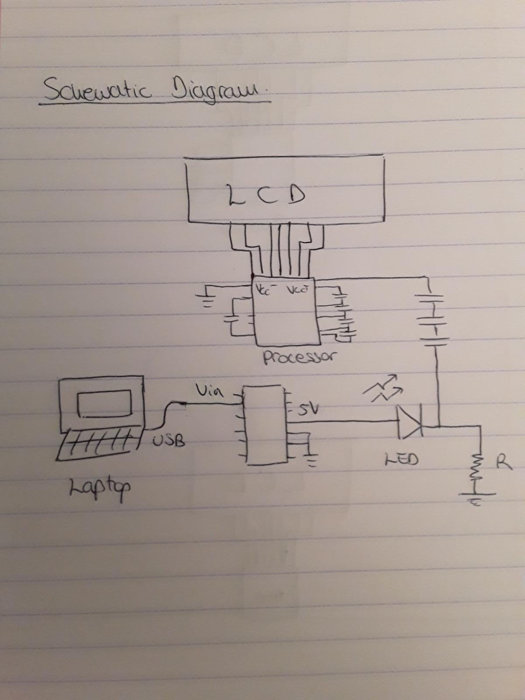

# IDD-Fa18-Lab1: Blink!

**A lab report by Eva Pilar Esteban Velasco**

## Part A. Set Up a Breadboard

[Breadboard Picture Link](Breadboard_A.jpeg)

## Part B. Manually Blink a LED

**a. What color stripes are on a 220 Ohm resistor?**
 
There are 4 stripes. These are, from left to right, red, red, black, black, brown. The first red indicates 2, the second red indicates 2, the first black indicates 0, the second black indicates a power of 1, and the final brown stripe indicates 1% tolerance. 
 
**b. What do you have to do to light your LED?**

Set up the circuit specified in the lab and press the button continuously to create power continuity. When the button is released, the continuity is interrupted and the LED stops emitting light.

## Part C. Blink a LED using Arduino

### 1. Blink the on-board LED

**a. What line(s) of code do you need to change to make the LED blink (like, at all)?**

Following the Blink example, the first line of code that needs to be added to a blank Arduino code for the built-in LED to blink is the set-up of the LED as an output. Then, in the loop, digitalWrite() can be used to give a high or low voltage to the LED. Between each digitalWrite() a delay can be added to keep the LED on/off for the amount of time needed. I personally chose to use a delay of 2 seconds. In the case where the Blink example code is loaded directly, no lines of code need to be changed and the built-in LED will blink every second.

**b. What line(s) of code do you need to change to change the rate of blinking?**

The delay() function between the digitalWrite() calls. It measures the time in milliseconds, so for example delay(1000) will create a delay of 1 second.

**c. What circuit element would you want to add to protect the board and external LED?**

A resistor, for example in the range of hundreds of Ohms. 
 
**d. At what delay can you no longer *perceive* the LED blinking? How can you prove to yourself that it is, in fact, still blinking?**

At 10 milliseconds delay I can no longer perceive that the LED is blinking. One of the ways to prove that the LED is in fact still blinking would be to make a video of the circuit and watch it on slow motion.

**e. Modify the code to make your LED blink your way. Save your new blink code to your lab 1 repository, with a link on the README.md.**

### 2. Blink your LED

**Make a video of your LED blinking, and add it to your lab submission.**

## Part D. Manually fade an LED

**a. Are you able to get the LED to glow the whole turning range of the potentiometer? Why or why not?**

Yes, the LED lights up throughout the whole range of the potentiomenter because the resistance of the potentiometer does not go high enough to now allow for the minimum amount of current that the LED needs to light up to flow. The LED glows lighter when the resistance of the potentiometer is set higher, and dimmer when the resistance is set to lower values. 

## Part E. Fade an LED using Arduino

**a. What do you have to modify to make the code control the circuit you've built on your breadboard?**

The "led" variable needs to be set to 11 instead of 9. 

**b. What is analogWrite()? How is that different than digitalWrite()?**

analogWrite(pin, value) is a function to set the duty cycle of the specified pin. The range for the "value" field is 0 to 255, where 0 indicates always off and 255 indicates always on.

digitalWrite(pin, value) sets the pin to either a HIGH (5 volts or 3.3 volts depending on the Arduino board) or a LOW (0 volts) state. These states are set in the "value" field of the function.

Therefore, while digitalWrite() only allows us to turn an LED on or off, analogueWrite() allows us to make the LED shine brighter or dimmer.

## Part F. FRANKENLIGHT!!!

### 1. Take apart your electronic device, and draw a schematic of what is inside. 

![Calculator Front Picture] (Calculator_Front.jpeg)
![Calculator Back Picture] (Calculator_Back.jpeg)
![Calculator Schematic] (Calculator_Diagram.jpeg)

**a. Is there computation in your device? Where is it? What do you think is happening inside the "computer?"**

There is a computation unit or processor that allows the device to perform the calculations and to store some limited information. This is the component labelled as U101 that is protected by the black material forming a circle. I think the processing unit receives the information from the buttons and performs the mathematical computations. It also stores the necessary information while the user is inputting the numbers to perform the calculations on, and has capacity to hold or remove a value in memory if the user presses the M+ button or the M- button respectively.

**b. Are there sensors on your device? How do they work? How is the sensed information conveyed to other portions of the device?**

Yes, there are some sensors on the device. When looking inside the device from an angle (so as not to completely detach the Printed Circuit Board (PCB) and risk breakage) we can observe a grey keyboard sensor. When a user presses a button, continuity is created between the keyboard sensor and the circuit under it. The processor obtains the information for which button it is that the user pressed and performs the necessary tasks. The processor also displays the appropriate information on the Liquid Crystal Display (LCD). 

**c. How is the device powered? Is there any transformation or regulation of the power? How is that done? What voltages are used throughout the system?**

The device is powered by a Panasonic RO3 AAA batter of 1.5 volts. The only electronic components I could identify on the PCB were the power battery, the processors, several capacitors and numerous tests points. The capacitors could be used to smooth voltage, but not to output a constant voltage value regardless of the input voltage value like standard voltage regulators do. Since I could not identify any voltage regulators, I concluded that the circuit operates at 1.5 volts. 

**d. Is information stored in your device? Where? How?**

Yes, information is stored in the processing unit. Microprocessors usually store the information in registers, so I concluded that this is how the calculator works. The processing unit can then perform mathemtical operations with the information stored in these registers and output the correct results. 

### 2. Using your schematic, figure out where a good point would be to hijack your device and implant an LED.

First, an LED was implanted between the battery and the circuit, but it did not light up. After researching LED forward voltages, I concluded that most LEDs need 1.7 volts or above to light up, and since the battery used by the calculator only outputs a maximum of 1.5 volts, I decided to try a different method of hijacking the calculator to build a light. In this case, I provided power from the computer USB port to the Metro Mini and provided 5 volts from the metro mini into the circuit. These 5 volts are fed to the LED. I chose a blue LED because blue LEDs usually drop between 3 and 3.3 volts, which is the highest drop out of all the LED colors available to me with the kit. Since 5 - 3.3 = 1.7 volts, I added a resistor to drop the voltage closer to 1.5 volts and feed this resulting voltage to the calculator. In this way, the calculator is still being powered with approximately the voltage it received from the battery, but it has been hijacked to incorporate an LED light. A further improvement to this design would be to add a button to turn the LED on/off, but in this case I want the LED to indicate power on/off so I avoided using the button.

### 3. Build your light!

**Make a video showing off your Frankenlight.**

**Include any schematics or photos in your lab write-up.**

